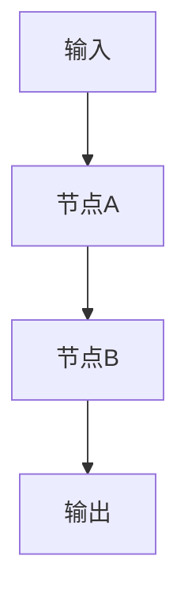

# 工作流文档阅读与修改指南

## 概述

本文档定义工作流文档的阅读、解析和修改规范，用于指导 hy-skill 的工作流文档阅读模块。

---

## 1. 文档存放位置

工作流文档统一存放在：`hy-skill/hy-custom-workflow/`

命名规范：`【前缀】工作流名称.md`

示例：
- `【Ver.】解码指定项目的进度.md`
- `【Ver.】更新基础数据文档数据版本.md`
- `【H.】文档知识更新与版本同步.md`

---

## 2. 标准文档结构

### 2.1 完整结构模板

```markdown
# 【前缀】工作流名称

## 基本信息

| 属性 | 值 |
|------|-----|
| **流程名称** | 工作流名称 |
| **流程ID** | process:xxxx |
| **状态** | 已发布/草稿 |
| **创建时间** | YYYY-MM-DD HH:mm:ss |
| **更新时间** | YYYY-MM-DD HH:mm:ss |
| **创建者** | 用户名 |
| **版本** | vx |

---

## 流程类型

**xxx流程**：详细描述

---

## 输入变量

| 变量名 | 类型 | 必填 | 说明 |
|--------|------|------|------|
| 变量1 | TEXT/JSON/... | ✅/❌ | 说明 |
| 变量2 | TEXT/JSON/... | ✅/❌ | 说明 |

---

## 输出变量

| 变量名 | 类型 | 说明 |
|--------|------|------|
| 变量1 | TEXT/JSON/... | 说明 |

---

## 执行路径

```
输入节点 → 节点A → 节点B → 输出节点
```

---

## 详细节点配置

### 1. 节点名称 (节点类型) - ID: xxx

- **名称**：节点名称
- **功能**：节点功能说明

**输入变量**：
- 变量名: 类型

**输出变量**：
- 变量名: 类型

**配置详情**：
- 配置项: 值

---

## Mermaid 流程图



---

## 核心功能说明

工作流的主要功能说明...

---

## 变量传递关系

```
输入变量：
├─ 类型：变量名（说明）
└─ 类型：变量名（说明）

中间变量：
├─ 类型：变量名
│   └─ 来源：节点输出
└─ 类型：变量名
    └─ 来源：节点输出

输出变量：
├─ 类型：变量名
└─ 类型：变量名
```

---

## 子工作流依赖

| 子工作流名称 | 流程ID | 用途 |
|-------------|--------|------|
| 工作流名称 | process:xxxx | 用途说明 |

---

## 注意事项

1. 注意事项1
2. 注意事项2

---

*文档生成时间: YYYY-MM-DD*
```

### 2.2 必要章节

| 章节 | 必要性 | 说明 |
|------|--------|------|
| 基本信息 | ✅ 必要 | 流程标识和元数据 |
| 流程类型 | ✅ 必要 | 流程分类说明 |
| 输入变量 | ✅ 必要 | 输入参数定义 |
| 输出变量 | ✅ 必要 | 输出结果定义 |
| 执行路径 | ✅ 必要 | 流程走向描述 |
| 详细节点配置 | ✅ 必要 | 每个节点的详细配置 |
| Mermaid 流程图 | ✅ 必要 | 可视化流程图 |
| 核心功能说明 | ✅ 必要 | 功能概述 |
| 变量传递关系 | ⚠️ 推荐 | 变量流转说明 |
| 子工作流依赖 | ⚠️ 推荐 | 依赖关系说明 |
| 注意事项 | ⚠️ 推荐 | 使用提示 |

---

## 3. 文档阅读流程

### 3.1 标准阅读流程

```
步骤 1：读取文档
 ↓
使用 Read 工具读取指定路径的 Markdown 文件
 ↓
步骤 2：解析结构
 ↓
识别文档章节，提取关键信息：
- 基本信息（流程ID、状态、版本等）
- 输入输出变量
- 节点配置详情
- 流程走向
- 子工作流依赖
 ↓
步骤 3：理解内容
 ↓
分析工作流逻辑：
- 数据流向
- 节点间依赖关系
- 条件分支逻辑
- 并行/循环结构
 ↓
步骤 4：输出摘要
 ↓
向用户展示文档摘要，询问具体需求
```

### 3.2 信息提取规则

| 信息类型 | 提取位置 | 提取方式 |
|---------|---------|---------|
| 流程ID | 基本信息表格 | 正则匹配 `process:\d+` |
| 流程状态 | 基本信息表格 | 读取"状态"行 |
| 输入变量 | 输入变量表格 | 解析表格内容 |
| 输出变量 | 输出变量表格 | 解析表格内容 |
| 节点配置 | 详细节点配置章节 | 按章节标题识别 |
| 流程走向 | 执行路径章节 | 提取流程描述 |
| 子工作流 | 子工作流依赖表格 | 解析表格内容 |

---

## 4. 文档修改流程

### 4.1 修改类型分类

| 修改类型 | 触发关键字 | 处理方式 |
|---------|-----------|---------|
| 文档内容修正 | "修正"、"修改"、"更正" | 直接修改 Markdown |
| 节点配置调整 | "调整节点"、"修改配置" | 更新节点配置章节 |
| 流程优化 | "优化流程"、"改进流程" | 调用工作流搭建模块 |
| 功能扩展 | "添加功能"、"扩展功能" | 调用工作流搭建模块 |
| 版本更新 | "更新版本"、"升级版本" | 更新基本信息和变更记录 |

### 4.2 修改执行流程

```
步骤 1：确认需求
 ↓
向用户确认具体修改内容
 ↓
步骤 2：分析影响
 ↓
评估修改对文档结构的影响：
- 是否影响其他章节
- 是否需要更新流程图
- 是否需要更新变量传递关系
 ↓
步骤 3：执行修改
 ↓
根据修改类型选择处理方式：
- 直接修改 → 使用 SearchReplace 更新文档
- 结构修改 → 调用工作流搭建模块设计新流程
 ↓
步骤 4：更新关联内容
 ↓
同步更新：
- Mermaid 流程图
- 变量传递关系
- 子工作流依赖
- 注意事项
 ↓
步骤 5：保存文档
 ↓
使用 Write 工具保存修改后的文档
```

### 4.3 修改后检查清单

- [ ] 基本信息是否需要更新
- [ ] 输入输出变量表是否完整
- [ ] 执行路径描述是否准确
- [ ] 节点配置是否与修改一致
- [ ] Mermaid 流程图是否同步更新
- [ ] 变量传递关系是否正确
- [ ] 子工作流依赖是否需要更新
- [ ] 注意事项是否需要补充

---

## 5. 与其他模块的联动

### 5.1 联动场景

| 场景 | 联动模块 | 处理方式 |
|------|---------|---------|
| 文档不存在 | 工作流识别 | 先识别工作流生成文档 |
| 添加新节点 | 工作流搭建 | 调用搭建模块设计节点 |
| 修改 Python 代码 | Python 代码生成 | 生成新代码并更新文档 |
| 修改 Agent 配置 | Agent 提示词 | 设计新配置并更新文档 |

### 5.2 联动流程示例

**场景：添加错误处理节点**

```
1. 用户请求：在工作流中添加错误处理节点
2. 文档阅读模块：
   - 读取当前工作流文档
   - 分析当前流程结构
   - 识别需要添加错误处理的位置
3. 调用工作流搭建模块：
   - 设计错误处理节点配置
   - 确定节点连接关系
   - 设计输入输出变量
4. 更新文档：
   - 添加节点配置说明
   - 更新执行路径
   - 更新 Mermaid 流程图
   - 更新变量传递关系
5. 保存文档并通知用户
```

---

## 6. 常见操作示例

### 6.1 阅读工作流文档

**用户输入**：
```
阅读工作流文档 c:\...\hy-custom-workflow\【Ver.】解码指定项目的进度.md
```

**Agent 响应**：
```
1. 读取文档内容
2. 解析文档结构
3. 输出摘要：

📄 【Ver.】解码指定项目的进度

基本信息：
- 流程ID: process:4640
- 状态: 已发布
- 版本: v1
- 创建者: hanyanting

流程类型：复合流程（线性流程 + 并行处理 + 条件判断）

核心功能：解码指定项目的进度状态

主要节点：
1. 并行处理节点 - 获取 step_order、项目进度、version
2. 工作流调用节点 - 调用 Decoder_Skill
3. 数据类型转换节点 - 转换为 JSON

输入变量：检索条件 (TEXT, 必填)
输出变量：A基础配置 (JSON)、result (JSON)、AVersion (TEXT)

4. 询问用户：您需要对这个工作流进行什么操作？
```

### 6.2 修改工作流文档

**用户输入**：
```
在这个工作流中添加一个日志记录节点
```

**Agent 响应**：
```
1. 确认需求：在工作流中添加日志记录节点
2. 分析当前流程结构
3. 设计日志记录节点：
   - 节点类型：Python代码执行
   - 功能：记录工作流执行日志
   - 位置：在并行处理节点之后
4. 调用工作流搭建模块设计节点配置
5. 更新文档内容：
   - 添加节点配置说明
   - 更新执行路径
   - 更新 Mermaid 流程图
6. 保存文档

✅ 已完成修改，日志记录节点已添加到工作流中。
```

### 6.3 扩展工作流功能

**用户输入**：
```
扩展这个工作流，添加错误通知功能
```

**Agent 响应**：
```
1. 确认需求：添加错误通知功能
2. 分析当前流程结构
3. 设计错误通知流程：
   - 添加条件判断节点：检测是否发生错误
   - 添加通知节点：发送错误通知
   - 设计通知内容模板
4. 调用工作流搭建模块设计新流程
5. 更新文档内容：
   - 添加新节点配置说明
   - 更新执行路径（添加错误分支）
   - 更新 Mermaid 流程图
   - 更新变量传递关系
6. 保存文档

✅ 已完成功能扩展，错误通知功能已添加。
```

---

## 7. 错误处理

### 7.1 常见错误

| 错误类型 | 错误信息 | 处理方式 |
|---------|---------|---------|
| 文件不存在 | 文档路径不存在 | 提示用户是否需要识别工作流 |
| 格式错误 | 文档结构不完整 | 尝试修复或提示用户 |
| 解析失败 | 无法解析节点配置 | 提示用户提供更多信息 |
| 修改冲突 | 修改影响其他功能 | 提示用户确认修改范围 |

### 7.2 错误恢复流程

```
错误发生
 ↓
记录错误信息到 ERRORS.md
 ↓
向用户说明错误原因
 ↓
提供解决方案建议
 ↓
等待用户确认后继续
```

---

## 更新记录

| 版本 | 日期 | 更新内容 |
|------|------|---------|
| 1.0 | 2026-03-14 | 初始版本，定义文档阅读与修改规范 |
